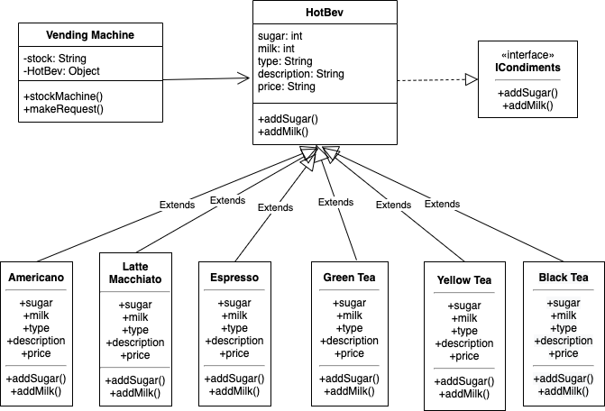

### Shelby Goudy, CS665 O2
#### Wk 6 Assignment, 17 Aug 21

## Assumptions:


## Task 1: Implementation Description. (2 points )

**How flexible is your implementation, e.g., how you add or remove in future new drink types?**


**How is the simplicity and understandability of your implementation?**


**How you avoided duplicated code?**


## Task 2: UML Class Diagram



## How to compile the project

```mvn clean compile```

## How to create a binary runnable package 

```mvn clean compile assembly:single```

## How to run

```mvn -q clean compile exec:java -Dexec.executable="edu.bu.met.cs665.Main" -Dlog4j.configuration="file:log4j.properties"```

## Run all the unit test classes.

```mvn clean compile test checkstyle:check  spotbugs:check```


## Using Spotbugs to find bugs in your project 

```mvn spotbugs:spotbugs```

```mvn spotbugs:check```

## Run Checkstyle 

```mvn checkstyle:check```